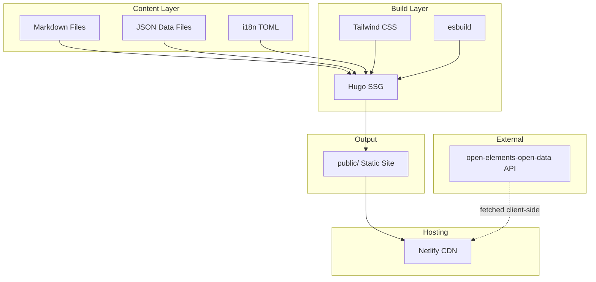

# Project Architecture

<!-- This file is generated and updated by the /project-analyze skill. You can also edit it manually. -->

## Overview

The Open Elements website is a bilingual (EN/DE) static site built with Hugo, styled with Tailwind CSS, and enhanced with a React component for interactive content. It is deployed on Netlify as two separate sites.

## Components

- **Hugo (Static Site Generator)** — Renders Markdown content and HTML templates into a static website. Handles i18n, navigation, and page routing.
- **Tailwind CSS** — Utility-first CSS framework with custom theme (brand colors, shadows, typography). Compiled from `input.css`.
- **React (Interactive UI)** — Single React component (`react-src/maven-prs.tsx`) for the Maven PR dashboard. Bundled with esbuild to an IIFE in `static/js/`.
- **Netlify (Hosting/CD)** — Builds and serves the site. Two deployments: `open-elements-en` (open-elements.com) and `open-elements-de` (open-elements.de).

## Content & Data Flow

```
content/*.md (Markdown)  ─┐
data/*.json (Structured)  ─┼─→  Hugo  ─→  public/ (Static HTML)  ─→  Netlify CDN
layouts/*.html (Templates) ─┤
i18n/*.toml (Translations) ─┘
```

- **Markdown content** (`content/`) provides page bodies (blog posts, articles, service pages).
- **JSON data** (`data/`) provides structured information (team members, navigation, partners, engagements).
- **Translation strings** (`i18n/`) provide UI labels in English and German.
- **Templates** (`layouts/`) combine content, data, and translations into HTML pages.

## Build Pipeline

```
input.css  ─→  Tailwind CLI  ─→  assets/css/style.css
react-src/ ─→  esbuild       ─→  static/js/maven-prs.js
content/ + layouts/ + data/  ─→  Hugo  ─→  public/
```

All three steps run in parallel during development (`npm run dev`) and sequentially for production builds (`npm run netlify:build`).

## Architecture Diagram



## Key Architectural Decisions

- **Hugo over JS-based SSGs** — Chosen for fast build times and simplicity for a content-heavy site.
- **React only where needed** — A single React component is used for the interactive Maven PR dashboard; the rest is server-rendered HTML.
- **File-based content** — No CMS. Content is managed as Markdown files and JSON data in the repository.
- **Bilingual via Hugo i18n** — English and German are handled through Hugo's native language support with separate data directories and translation files.
- **Netlify dual-site deployment** — Separate builds for `.com` (EN) and `.de` (DE) with different base URLs.