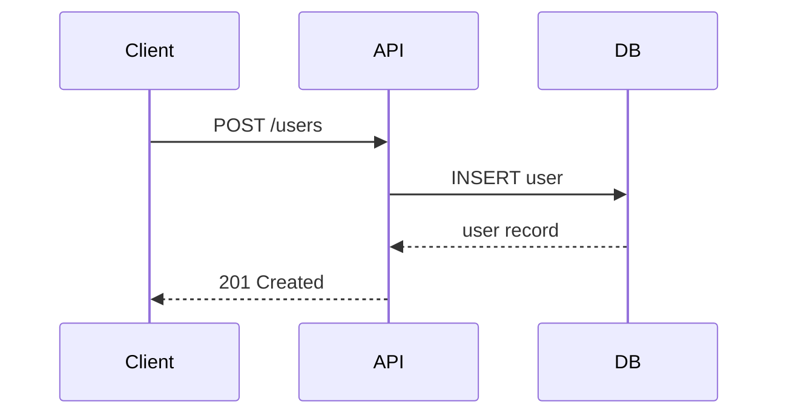

# Spec-Driven Development

This document defines the structure and conventions for the `specs/` directory used in spec-driven development. Features and bug fixes are planned as specifications before implementation begins.

## Overview

Every non-trivial change goes through a specification phase:
1. A GitHub issue describes the **what** and **why**
2. A spec folder contains the **how** — technical design, behavioral scenarios, and optionally implementation steps
3. Implementation follows the spec, and is verified against it

## Directory Structure

Specs live in a `specs/` directory in the project root. Each spec gets its own sub-folder:

```
specs/
├── 42-user-auth-flow/
│   ├── design.md
│   ├── behaviors.md
│   └── steps.md          (optional)
├── 87-csv-export-api/
│   ├── design.md
│   └── behaviors.md
└── ...
```

### Folder Naming

- **Based on a GitHub issue:** `<issue-number>-short-description` (e.g., `42-user-auth-flow`)
- **Without an issue:** `short-description` (e.g., `csv-export-api`)
- Keep the description to 3–4 words in kebab-case

## Files

### `design.md` — Technical Design

Describes the technical approach for the change. Sections (include only what is relevant):

- **GitHub Issue** — Link to the source issue
- **Summary** — What is being built and why (1–2 paragraphs)
- **Goals** — What this change aims to achieve
- **Non-goals** — What is explicitly out of scope
- **Technical approach** — High-level implementation strategy
- **API design** — Endpoints, request/response shapes, status codes
- **Data model** — Entities, relationships, migrations
- **Key flows** — Step-by-step execution paths
- **Dependencies** — External services, libraries, internal modules
- **Security considerations** — Auth, validation, data exposure
- **Open questions** — Unresolved items

Key design decisions include a brief **rationale** explaining why the approach was chosen over alternatives.

**For bug fixes**, the design focuses on different sections:
- **Summary** — What is broken and what is the user-visible impact
- **Reproduction** — Steps to reproduce the bug, preconditions, environment details
- **Root cause analysis** — Why the bug occurs, which component is responsible
- **Fix approach** — How the bug will be fixed, which files/components change
- **Regression risk** — What could break as a side effect

Use **Mermaid diagrams** where they help clarify the design — for example sequence diagrams for key flows, entity-relationship diagrams for data models, or component diagrams for architecture. Embed them directly in the Markdown using fenced code blocks:

````markdown

````

Diagrams are optional — only add them when they communicate structure or flow more clearly than text alone.

### `behaviors.md` — Behavioral Scenarios

Defines the expected behavior using given-when-then scenarios (Behavior-Driven Design). These scenarios serve as the basis for unit and integration tests.

Format:

```markdown
# Behaviors: <Spec Name>

## <Feature or Area>

### <Scenario Name>

- **Given** <precondition>
- **When** <action>
- **Then** <expected outcome>
```

Coverage should include:
- **Happy paths** — Main success scenarios
- **Edge cases** — Boundary values, empty inputs, concurrent access
- **Error cases** — Invalid input, missing permissions, downstream failures
- **State transitions** — Before/after states where relevant

Each scenario should be specific enough to translate directly into a test case.

### `steps.md` — Implementation Steps (optional)

An ordered, actionable checklist for implementing the spec. Uses GitHub-flavored Markdown checkboxes for tracking progress:

```markdown
# Implementation Steps: <Spec Name>

## Step 1: <Title>

- [ ] Create `src/models/user.ts` with fields: id, email, name, createdAt
- [ ] Create migration `migrations/001_create_users.sql`

**Acceptance criteria:**
- [ ] Migration runs successfully
- [ ] Entity can be instantiated in a test
- [ ] Unit tests for new code exist and pass
- [ ] Project builds successfully

**Related behaviors:** User creation happy path

---

## Step 2: <Title>
...
```

Each step is:
- **Atomic** — One focused change
- **Independently verifiable** — Can be confirmed after completion
- **Sequenced by dependency** — Earlier steps are foundations for later ones

## Workflow

The spec-driven workflow uses three skills:

| Skill | Purpose |
|-------|---------|
| `/spec-create` | Create `design.md` and `behaviors.md` through interactive discussion |
| `/spec-implement` | Generate `steps.md` from a completed spec |
| `/spec-review` | Verify implementation completeness against design and behaviors |

A typical flow:
1. Start with a GitHub issue (or create one first)
2. `/spec-create` — Plan the change collaboratively
3. `/spec-implement` — Break it down into steps (optional)
4. Implement (manually, guided, or automated)
5. `/spec-review` — Verify completeness

## Principles

- **Issue first** — Every PR should have a corresponding GitHub issue
- **Discuss before writing** — Specs are created through dialogue, not generated silently
- **Right-size the spec** — A bug fix needs less documentation than a new feature. Skip sections that are not relevant.
- **Living documents** — Specs can be updated during implementation if decisions change. Keep them in sync.
- **Specs are not throwaway** — They remain in the repository as documentation of design decisions and expected behavior
- **Commits and PRs are human work** — Developers create commits and pull requests themselves. The spec folder and its design decisions should be referenced in the PR description, but the PR itself is authored by the developer, not generated by AI.
