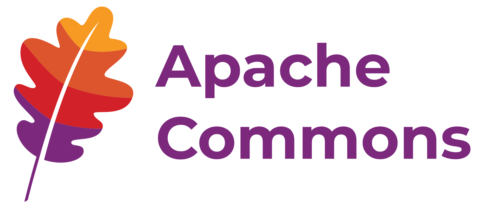
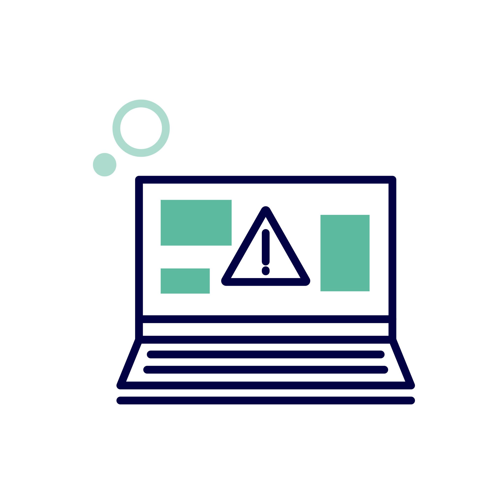
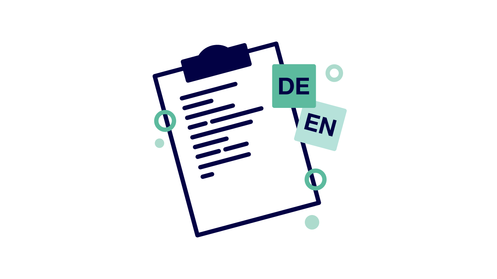
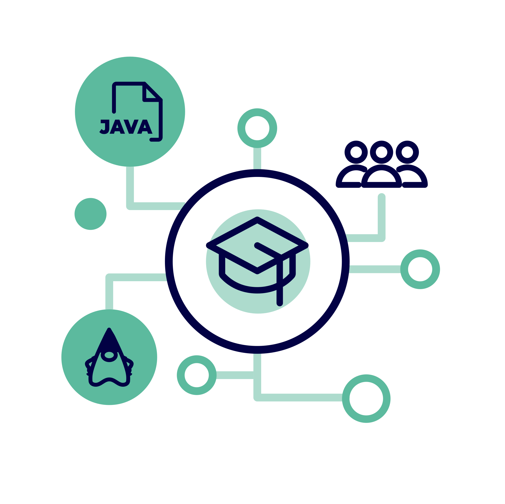
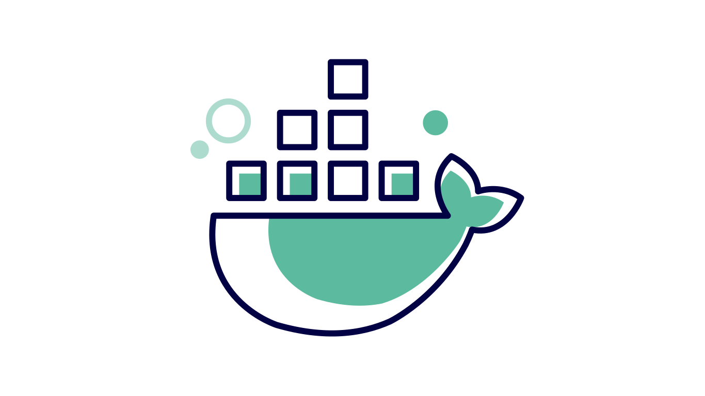

  <h1 style="font-size: 2.5rem; font-weight: 800; line-height: 1.2; margin-bottom: 1rem;">Ihre Java-Basis professionell betreut</h1>
  
Professionelle Wartung, Sicherheitsupdates und Long Term Support für die geschäftskritischsten Open-Source-Komponenten im Java-Ökosystem — direkt von den Maintainern.

Moderne Software besteht zu uber 70 % aus Open-Source-Komponenten.
Ab 2027 macht der Cyber Resilience Act (CRA) Hersteller fur 100 % ihrer Software verantwortlich — einschliesslich aller OSS-Abhangigkeiten.
Support & Care sichert die Basis Ihrer Java-Anwendungen: von der Laufzeitumgebung uber Build-Tools bis zur Teststrategie.

  <a href="/contact" class="inline-flex shrink-0 items-center justify-center gap-3 px-6 py-3.5 text-lg font-bold text-white text-center bg-sky rounded-full transition-all duration-150 ease-in-out hover:bg-sky-200 hover:shadow-8 active:shadow-none">Kontakt aufnehmen</a>
  <a href="#unsere-leistungen" class="inline-flex shrink-0 items-center justify-center gap-3 px-6 py-3.5 text-lg font-bold text-white text-center bg-sky rounded-full transition-all duration-150 ease-in-out hover:bg-sky-200 hover:shadow-8 active:shadow-none">Leistungen entdecken</a>



  
  
  
  
  

## Das Problem: Unsichtbare Abhängigkeiten

Ein einfaches Java-Projekt mit Spring Boot bringt uber 70 transitive Abhangigkeiten mit — die meisten davon Open Source.
Ihr individueller Code ist nur die Spitze des Eisbergs.
Darunter liegen Laufzeitumgebungen, Build-Tools, Logging-Frameworks, Test-Bibliotheken und Utility-Libraries, die den eigentlichen Betrieb Ihrer Anwendung tragen.

TODO: **Umfragen? Analysen? zeigen: 70 % von Software basiert auf OSS und liegt somit ausserhalb Ihrer Kontrolle**

Diese Basiskomponenten werden häufig von einzelnen Entwicklern in ihrer Freizeit gepflegt.
Gleichzeitig tragen sie den Grossteil der technischen Risiken:
Sicherheitslucken, transitive Abhangigkeiten, fehlende Dokumentation und Compliance-Verantwortung.

**Was das fur Sie bedeutet:**
- Schwachstellen in Basiskomponenten bleiben oft unbemerkt, bis es zu spat ist
- Framework-Support allein schutzt nicht vor Lucken in der Basis — das hat <a href="https://www.bsi.bund.de/DE/Themen/Verbraucherinnen-und-Verbraucher/Cyber-Sicherheitslage/Schwachstelle-log4Shell-Java-Bibliothek/log4j_node.html" target="_blank" rel="noopener">Log4Shell</a> eindeutig gezeigt
- Der CRA macht Sie ab 2027 fur die gesamte Software-Lieferkette haftbar

TODO: BILD EISBERG MIT SCHICHTEN

## Die betreuten Komponenten

Support & Care betreut gezielt fünf geschäftskritischste Open-Source-Basiskomponenten des Java-Okosystems.
Gemeinsam bilden sie die technische Vertrauenskette für fast jede Java-Anwendung.

  

    
    <strong>Eclipse Temurin — Java-Runtime</strong>
    
Fuhrende herstellerunabhangige OpenJDK-Distribution weltweit Uber 500.000 Downloads pro Tag TCK-zertifiziert, AQAvit-verifiziert, Community-getragen

  

  

    
    <strong>Apache Maven — Build & Dependency Management</strong>
    
Uber 75 % aller Java-Projekte setzen auf Maven Ca. 2 Milliarden Downloads jahrlich

  

  

    
    <strong>JUnit — Testframework</strong>
    
Uber 1 Milliarde Downloads pro Monat Ca. 85 % Marktanteil im Java-Okosystem

  

  

    
    <strong>Apache Log4j — Logging</strong>
    
Ca. 76 % aller Java-Anwendungen nutzen Log4j Geschäftskritisch fur Protokollierung, Monitoring und Fehleranalyse

  

  

    
    <strong>Apache Commons — Standard-Libraries</strong>
    
Ca. 49 % der Java-Entwickler setzen Apache Commons aktiv ein Modulare Sammlung: Lang, IO, Collections und weitere

  

**Kurz gesagt: Die essentielle Basis der technischen Vertrauenskette Ihrer Java-Anwendungen.**

## Wo Support & Care ansetzt

Java-Anwendungen lassen sich in drei Schichten gliedern:

TODO: Bild der Pyramide

1. **Anwendungsspezifischer Code** 
   Ihr individueller Geschäfts- und Fachlogik-Code. Diese Ebene ist hochst wertvoll, aber relativ klein im Umfang — sie baut auf Frameworks und Basistechnologien auf.

2. **Frameworks & Anwendungsplattformen** 
   Spring Boot, Quarkus, Jakarta EE und andere. Fur diese Ebene gibt es vielfach kommerziellen Support der jeweiligen Anbieter.

3. **Basiskomponenten** — **Hier setzt Support & Care an.**
   Laufzeitumgebung, Build- und Dependency-Management, Standardbibliotheken, Logging- und Test-Frameworks. Diese Komponenten kommen in praktisch jedem Java-Projekt vor — doch professionellen Support gibt es dafur bisher kaum.

**Framework-Support allein reicht nicht. Die <a href="https://www.bsi.bund.de/DE/Themen/Verbraucherinnen-und-Verbraucher/Cyber-Sicherheitslage/Schwachstelle-log4Shell-Java-Bibliothek/log4j_node.html" target="_blank" rel="noopener">Log4Shell-Schwachstelle</a> hat gezeigt: Eine kritische Sicherheitslucke in einer Basiskomponente kann Millionen von Anwendungen treffen — trotz aktueller Framework-Updates. Support & Care schliesst genau diese Lucke.**

## Unsere Leistungen

Alle Leistungen werden direkt von den Maintainern und Committern der betreuten Projekte erbracht — nicht von einem nachgelagerten Support-Team.

  

    
    <strong>Long Term Support (LTS)</strong>
    
Weiterfuhrung fur die wichtigsten Versionen zur besseren Planung und Organisation Ihrer Updates. Sie mussen keine unsicheren oder nicht gewarteten Versionen einsetzen.

  

  

    
    <strong>Sicherheitsupdates & Bugfixes</strong>
    
Fruhzeitige Informationen und Benachrichtigungen zu Schwachstellen und Patches. Schnelle Reaktionszeiten durch direkten Zugang zu den Entwicklern.

  

  

    
    <strong>Dokumentation & Transparenz</strong>
    
Unterstutzung bei SBOM-Strategien und technischer Dokumentation — auf Deutsch oder Englisch. Transparente Nachvollziehbarkeit aller Anderungen.

  

  

    
    <strong>Workshops & Beratung</strong>
    
Direkter Austausch mit den Maintainern und Committern der Projekte — auf Deutsch oder Englisch. Individuelle Beratung zu Migration, Best Practices und Architekturentscheidungen.

  

  

    
    <strong>Regelmässige Webinare & Statusupdates</strong>
    
Quartalsweise Webinare zu aktuellen Sicherheitsrisiken, wichtigen Versionsanderungen, Best-Practice-Empfehlungen und konkreten Auswirkungen auf Ihre OSS-Lieferkette.

  

  

    
    <strong>Kundenspezifische Builds & Tooling</strong>
    
Massgeschneiderte Umsetzungen direkt durch die Maintainer — von speziellen Build-Konfigurationen bis zu individualisierten Tooling-Losungen.

  

### Vorbereitet auf den Cyber Resilience Act

Ab 2027 sind Hersteller im Rahmen des Cyber Resilience Act (CRA) fur 100 % ihrer Software verantwortlich — einschliesslich aller Open-Source-Abhangigkeiten.
Das betrifft Patchzeiten, Schwachstellenmanagement, Dokumentation und langfristige Wartbarkeit.
Open Elements agiert als Open-Source-Steward und gestaltet die regulatorischen Rahmenbedingungen aktiv mit.
Als Grundungsmitglied der **Open Regulatory Compliance Working Group (ORC WG)** der Eclipse Foundation arbeiten wir gemeinsam mit fuhrenden Open-Source-Foundations, grossen Technologieunternehmen und Vertretern der EU an konkreten Spezifikationen und Praxisleitfaden zur CRA-Umsetzung.

**Support & Care hilft Ihnen konkret bei:**
- Deutliche Reduzierung von Patchzeiten
- Systematische Schwachstellenuberwachung
- Planbare Verfugbarkeit von Updates
- Sicherstellung von Dokumentation und Transparenz (inkl. SBOM)
- Langfristige Wartbarkeitsgarantie
- Perspektivisch: CRA-konforme Attestierungen fur betreute Projekte

**Open Elements ist Grundungsmitglied der ORC WG und arbeitet direkt an den Best Practices, die definieren, wie CRA-Compliance fur Open-Source-Software umgesetzt wird. Diese Expertise fliesst unmittelbar in Support & Care ein.**

### Gehärtete Container für Staat und Verwaltung

Auch das ist Support & Care: Gehärtete Container fur die deutsche Verwaltung

Open Elements gehort zu einer exklusiven Gruppe von Organisationen, die gehärtete Container-Images fur **container.gov.de** bereitstellen durfen — neben dem Zentrum fur Digitale Souveranitat (ZenDiS) und dem Auswartigen Amt.
Für Support & Care Kunden bedeutet das: Die gehärteten Eclipse-Temurin-Images für alle aktuellen Java-LTS-Versionen (Java 11, 17, 21, 25+) sind Teil des Leistungsumfangs.
Verifiziert, signiert und kontinuierlich gegen aktuelle Schwachstellendatenbanken abgeglichen.

**Was gehärtete Container auszeichnet:**
- Verifizierte Herkunft und Qualitätssicherung
- Aktuelle Abhängigkeiten ohne bekannte Schwachstellen
- Software Bill of Materials (SBOM) fur volle Transparenz
- Kryptographische Signierung gegen Manipulation
- Minimierte Angriffsflache durch systematisches Hardening



## Mehr als nur Support: Unser Modell

Support & Care funktioniert anders als klassischer Vendor-Support.
Sie tragen gemeinsam mit uns die laufenden Pflege- und Verbesserungsaufwande fur die betreuten Open-Source-Komponenten — offen, nachvollziehbar und messbar.

Hier folgt Support & Care drei wichtigen Prinzipien:

- **1. Gelder fliessen direkt an die Maintainer**: Statt oberflachliche Support-Schichten daruber zu legen, investieren wir in die Vitalitat des jeweiligen Projekt-Kerns. Die Menschen, die den Code tatsachlich pflegen, Sicherheitsupdates bereitstellen und neue Features entwickeln, werden direkt bezahlt.
- **2. Ihre Prioritaten in den Roadmaps**: Kundenanforderungen werden aktiv in die Entwicklungs-Roadmaps der betreuten Projekte integriert. So spiegeln Weiterentwicklungen direkt reale Unternehmensbedurfnisse wider.
- **3. Proaktive Kommunikation**: Sie werden nicht nur bei Problemen informiert, sondern kontinuierlich uber relevante Entwicklungen auf dem Laufenden gehalten:
  - Sicherheitswarnungen und neue Patches
  - Geplante API- oder Major-Version-Anderungen
  - Empfehlungen zu Versionsupdates und Abhangigkeitsbereinigungen
  - Trends und Risiken im OSS-Okosystem

> Nicht genutzte Support-Stunden verfallen nicht — sie fliessen direkt in die Weiterentwicklung der Open-Source-Komponenten. Jede Subscription starkt die Projekte, auf die Sie sich verlassen.

Hierbei liefern wir flexible Leistungsmodelle für nachhaltige Sicherheit.
Wählen Sie das Modell, das zu Ihren Anforderungen in Verfügbarkeit, Compliance und SLA passt.



## Warum Open Elements

Wir sind die Maintainer — nicht nur Berater:
Unsere Mitarbeiter sind keine externen Consultants, die Projekte erst kennenlernen müssen.
Sie sind die Menschen, die diese Projekte pflegen, weiterentwickeln und in den Foundations mitgestalten.

TODO: Bild Personen mit Position

Open Elements ist ein bekanntes und aktives Mitglied der Open Source Community und arbeitet nicht nur auf technischer Basis sondern auch auf Leitender Ebene in vielen Open Source Foundation mit:

TODO: Später Logo der Foundation und dann text

- Eclipse Foundation: Wir sind im Board der Eclipse Foundation vertrehten und aktives Mitglied in Arbeitsgruppen wie Eclipse Adoptium, Eclipse JakartaEE oder ORGWG.
- Linux Foundation: TODO
- Apache Foundation: TODO

> Open Source — aber richtig. Unsere Einnahmen aus Support & Care fliessen direkt in die betreuten Open-Source-Projekte.

## 12. Haufig gestellte Fragen

**Ist Support & Care nur fur Apache Maven?**
Nein.
Support & Care deckt fünf geschäftskritische Java-Basiskomponenten ab: Eclipse Temurin, Apache Maven, JUnit, Apache Log4j und Apache Commons.
Das Programm startete 2024 mit Maven und wurde seitdem kontinuierlich erweitert.

**Wer leistet den Support?**
Committer und Maintainer der jeweiligen Open-Source-Projekte — die Personen, die den Code tatsachlich schreiben und pflegen.
Kein nachgelagertes Support-Team, sondern direkter Zugang zu den Experten.

**Was passiert mit meiner Subscription-Gebühr?**
Die Einnahmen fliessen transparent und nachvollziehbar in die betreuten Open-Source-Projekte:
Bezahlung der Maintainer, Sicherheitsupdates, Bugfixes, Dokumentation und Infrastruktur.

**Muss ich alle fünf Komponenten abonnieren?**
Sprechen Sie uns an — wir schneiden das Angebot auf Ihre konkreten Anforderungen zu.

**Hilft Support & Care bei der CRA-Compliance?**
Ja.
Support & Care adressiert zentrale CRA-Anforderungen:
Schwachstellenüberwachung, Patchzeiten, Dokumentation, SBOM und langfristige Wartbarkeit.
Perspektivisch unterstutzen wir auch bei CRA-konformen Attestierungen.

**In welchen Sprachen wird Support geleistet?**
Deutsch und Englisch — sowohl für Helpdesk-Anfragen als auch für Workshops, Beratung und Dokumentation.

**Was ist der Unterschied zu Framework-Support (z.B. bei Spring Boot)?**
Framework-Support deckt die mittlere Schicht Ihres Software-Stacks ab.
Support & Care betreut die Basisschicht darunter: Laufzeit, Build-Tools, Logging, Testing und Utility-Libraries.
Beides ergänzt sich — <a href="https://www.bsi.bund.de/DE/Themen/Verbraucherinnen-und-Verbraucher/Cyber-Sicherheitslage/Schwachstelle-log4Shell-Java-Bibliothek/log4j_node.html" target="_blank" rel="noopener">Log4Shell</a> hat gezeigt, dass Framework-Support allein nicht ausreicht.

## Sichern Sie die Basis Ihrer Java-Anwendungen

Lassen Sie uns gemeinsam besprechen, wie Support & Care Ihre Software-Lieferkette absichert.
Ob Privatwirtschaft oder offentliche Verwaltung — wir finden das passende Modell für Sie.

  <a href="/contact" class="inline-flex shrink-0 items-center justify-center gap-3 px-6 py-3.5 text-lg font-bold text-white text-center bg-sky rounded-full transition-all duration-150 ease-in-out hover:bg-sky-200 hover:shadow-8 active:shadow-none">Kontakt aufnehmen</a>

Open Elements GmbH
Gerhart-Hauptmann-Str. 49B
51379 Leverkusen, Germany
info@open-elements.de

**Fussnoten:**
1. Nicht genutzte Support-Stunden verfallen monatlich und fliessen in die Weiterentwicklung der betreuten Projekte.
2. Werktage ohne Feiertage in NRW.
3. Helpdesk DSGVO-konform und EU-gehostet.
4. Expert:innen sind Committer und Maintainer der betreuten OSS-Projekte.
5. Webinare und Calls per Videokonferenz.