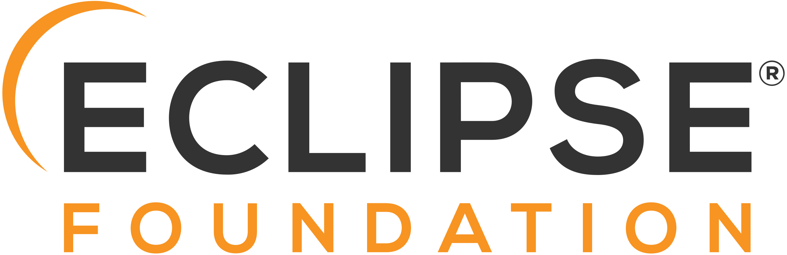
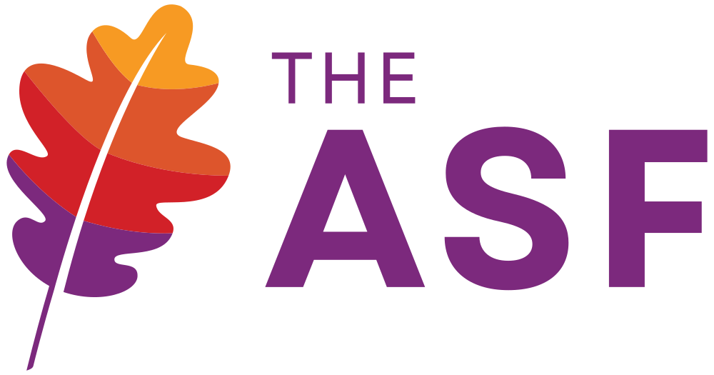



  
Professional maintenance, security updates and long term support for the most business-critical open source components in the Java ecosystem — directly from the maintainers.

  

    
    
    
    
    
  

  
Modern software consists of over 70% open source components. From 2027, the Cyber Resilience Act (CRA) will hold manufacturers responsible for 100% of their software — including all OSS dependencies. Support & Care secures the foundation of your Java applications: from the runtime environment to build tools and testing strategy.

  

    <a href="/contact" class="inline-flex shrink-0 items-center justify-center gap-3 px-6 py-3.5 text-lg font-bold text-white text-center bg-sky rounded-full transition-all duration-150 ease-in-out hover:bg-sky-200 hover:shadow-8 active:shadow-none" style="color: white !important; text-decoration: none !important;">Get in touch</a>
    <a href="#our-services" class="inline-flex shrink-0 items-center justify-center gap-3 px-6 py-3.5 text-lg font-bold text-white text-center bg-sky rounded-full transition-all duration-150 ease-in-out hover:bg-sky-200 hover:shadow-8 active:shadow-none" style="color: white !important; text-decoration: none !important;">Discover our services</a>
  

## The Problem: Invisible Dependencies

A simple Java project with Spring Boot brings over 70 transitive dependencies — most of them open source.
Your individual code is just the tip of the iceberg.
Underneath lie runtime environments, build tools, logging frameworks, test libraries and utility libraries that actually carry the operation of your application.

  70% of software is based on open source and is therefore outside your direct control.

These foundational components are often maintained by individual developers in their spare time.
At the same time, they carry the majority of technical risks:
security vulnerabilities, transitive dependencies, missing documentation and compliance responsibility.

**What this means for you:**
- Vulnerabilities in foundational components often go unnoticed until it is too late
- Framework support alone does not protect against gaps in the foundation — <a href="https://www.bsi.bund.de/DE/Themen/Verbraucherinnen-und-Verbraucher/Cyber-Sicherheitslage/Schwachstelle-log4Shell-Java-Bibliothek/log4j_node.html" target="_blank" rel="noopener">Log4Shell</a> clearly demonstrated this
- The CRA will hold you liable for the entire software supply chain from 2027

## Supported Components

Support & Care specifically covers the five most business-critical open source foundational components of the Java ecosystem.
Together, they form the technical chain of trust for virtually every Java application.

  

    
    <strong>Eclipse Temurin — Java Runtime</strong>
    
Leading vendor-independent OpenJDK distribution worldwide Over 500,000 downloads per day TCK-certified, AQAvit-verified, community-driven

  

  

    
    <strong>Apache Maven — Build & Dependency Management</strong>
    
Over 75% of all Java projects use Maven Approx. 2 billion downloads annually

  

  

    
    <strong>JUnit — Test Framework</strong>
    
Over 1 billion downloads per month Approx. 85% market share in the Java ecosystem

  

  

    
    <strong>Apache Log4j — Logging</strong>
    
Approx. 76% of all Java applications use Log4j Business-critical for logging, monitoring and error analysis

  

  

    
    <strong>Apache Commons — Standard Libraries</strong>
    
Approx. 49% of Java developers actively use Apache Commons Modular collection: Lang, IO, Collections and more

  

  In short: The essential foundation of the technical chain of trust for your Java applications.

## Where Support & Care Steps In

Java applications can be divided into three layers:



1. **Application-Specific Code**
   Your individual business and domain logic code. This layer is highly valuable but relatively small in scope — it builds on frameworks and foundational technologies.

2. **Frameworks & Application Platforms**
   Spring Boot, Quarkus, Jakarta EE and others. Commercial support from the respective vendors is widely available for this layer.

3. **Foundational Components** — **This is where Support & Care steps in.**
   Runtime environment, build and dependency management, standard libraries, logging and test frameworks. These components are used in virtually every Java project — yet professional support has been largely unavailable until now.

  Framework support alone is not enough. The <a href="https://www.bsi.bund.de/DE/Themen/Verbraucherinnen-und-Verbraucher/Cyber-Sicherheitslage/Schwachstelle-log4Shell-Java-Bibliothek/log4j_node.html" target="_blank" rel="noopener">Log4Shell vulnerability</a> demonstrated: A critical security flaw in a foundational component can affect millions of applications — despite up-to-date framework updates. Support & Care closes exactly this gap.

## Our Services

All services are delivered directly by the maintainers and committers of the supported projects — not by a downstream support team.

  

    
    <strong>Long Term Support (LTS)</strong>
    
Continued support for the most important versions to help you better plan and organize your updates. You never have to rely on insecure or unmaintained versions.

  

  

    
    <strong>Security Updates & Bugfixes</strong>
    
Early information and notifications about vulnerabilities and patches. Fast response times through direct access to the developers.

  

  

    
    <strong>Documentation & Transparency</strong>
    
Support with SBOM strategies and technical documentation — in German or English. Transparent traceability of all changes.

  

  

    
    <strong>Workshops & Consulting</strong>
    
Direct exchange with the maintainers and committers of the projects — in German or English. Individual consulting on migration, best practices and architectural decisions.

  

  

    
    <strong>Regular Webinars & Status Updates</strong>
    
Quarterly webinars on current security risks, important version changes, best practice recommendations and concrete impacts on your OSS supply chain.

  

  

    
    <strong>Custom Builds & Tooling</strong>
    
Tailored implementations directly by the maintainers — from special build configurations to individualized tooling solutions.

  

### Prepared for the Cyber Resilience Act

From 2027, manufacturers will be responsible for 100% of their software under the Cyber Resilience Act (CRA) — including all open source dependencies.
This covers patch times, vulnerability management, documentation and long-term maintainability.
Open Elements acts as an open source steward and actively shapes the regulatory framework.
As a founding member of the **Open Regulatory Compliance Working Group (ORC WG)** of the Eclipse Foundation, we work together with leading open source foundations, major technology companies and EU representatives on concrete specifications and practical guidelines for CRA implementation.

**Support & Care specifically helps you with:**
- Significant reduction of patch times
- Systematic vulnerability monitoring
- Predictable availability of updates
- Ensuring documentation and transparency (incl. SBOM)
- Long-term maintainability guarantee
- Prospectively: CRA-compliant attestations for supported projects

  Open Elements is a founding member of the ORC WG and works directly on the best practices that define how CRA compliance for open source software is implemented. This expertise flows directly into Support & Care.

### Hardened Containers for Government and Public Administration

This is also Support & Care: Hardened containers for the German public administration.

Open Elements belongs to an exclusive group of organizations authorized to provide hardened container images for **container.gov.de** — alongside the Center for Digital Sovereignty (ZenDiS) and the German Federal Foreign Office.
For Support & Care customers, this means: The hardened Eclipse Temurin images for all current Java LTS versions (Java 11, 17, 21, 25+) are included in the service scope.
Verified, signed and continuously checked against current vulnerability databases.

**What distinguishes hardened containers:**
- Verified origin and quality assurance
- Up-to-date dependencies without known vulnerabilities
- Software Bill of Materials (SBOM) for full transparency
- Cryptographic signing against tampering
- Minimized attack surface through systematic hardening



## More Than Just Support: Our Model

Support & Care works differently from traditional vendor support.
Together with us, you share the ongoing maintenance and improvement efforts for the supported open source components — openly, transparently and measurably.

Support & Care follows three important principles:

- **1. Funds flow directly to the maintainers**: Instead of layering superficial support on top, we invest in the vitality of each project's core. The people who actually maintain the code, provide security updates and develop new features are paid directly.
- **2. Your priorities in the roadmaps**: Customer requirements are actively integrated into the development roadmaps of the supported projects. This way, enhancements directly reflect real business needs.
- **3. Proactive communication**: You are not only informed when problems arise, but continuously kept up to date on relevant developments:
  - Security warnings and new patches
  - Planned API or major version changes
  - Recommendations for version updates and dependency cleanup
  - Trends and risks in the OSS ecosystem

  Unused support hours do not expire — they flow directly into the further development of the open source components. Every subscription strengthens the projects you rely on.

We deliver flexible service models for sustainable security.
Choose the model that fits your requirements in availability, compliance and SLA.



## Why Open Elements

We are the maintainers — not just consultants:
Our team members are not external consultants who first need to get to know the projects.
They are the people who maintain, develop and co-shape these projects within the foundations.

  <a href="/about-hendrik/" style="text-align: center; width: 180px; text-decoration: none; color: inherit;">
    
    <strong style="display: block; font-size: 0.95rem;">Hendrik Ebbers</strong>
    Founder & Eclipse Board Member
  </a>
  <a href="/employees/sandra" style="text-align: center; width: 180px; text-decoration: none; color: inherit;">
    
    <strong style="display: block; font-size: 0.95rem;">Sandra Parsick</strong>
    Java Champion & OSS Maintainer
  </a>
  <a href="/employees/sebastian" style="text-align: center; width: 180px; text-decoration: none; color: inherit;">
    
    <strong style="display: block; font-size: 0.95rem;">Sebastian Tiemann</strong>
    OSS Engineer & Maintainer Log4j
  </a>

Open Elements is a well-known and active member of the open source community, contributing not only on a technical level but also in leadership roles across many open source foundations:

  

    
    <strong>Eclipse Foundation</strong>
    
We hold a seat on the Eclipse Foundation Board and are active members of working groups such as Eclipse Adoptium, Eclipse JakartaEE and the ORC WG.

  

  

    
    <strong>Linux Foundation</strong>
    
TODO

  

  

    
    <strong>Apache Software Foundation</strong>
    
TODO

  

  Open source — done right. Our revenue from Support & Care flows directly into the supported open source projects.

## Frequently Asked Questions

  

    
Is Support & Care only for Apache Maven?

    
No. Support & Care covers five business-critical Java foundational components: Eclipse Temurin, Apache Maven, JUnit, Apache Log4j and Apache Commons. The program started in 2024 with Maven and has been continuously expanded since then.

  

  

    
Who provides the support?

    
Committers and maintainers of the respective open source projects — the people who actually write and maintain the code. No downstream support team, but direct access to the experts.

  

  

    
What happens with my subscription fee?

    
The revenue flows transparently and traceably into the supported open source projects: payment of maintainers, security updates, bugfixes, documentation and infrastructure.

  

  

    
Do I have to subscribe to all five components?

    
Get in touch — we tailor the offering to your specific requirements.

  

  

    
Does Support & Care help with CRA compliance?

    
Yes. Support & Care addresses key CRA requirements: vulnerability monitoring, patch times, documentation, SBOM and long-term maintainability. Prospectively, we also support CRA-compliant attestations.

  

  

    
In which languages is support provided?

    
German and English — for helpdesk requests as well as workshops, consulting and documentation.

  

  

    
What is the difference to framework support (e.g. Spring Boot)?

    
Framework support covers the middle layer of your software stack. Support & Care covers the foundational layer underneath: runtime, build tools, logging, testing and utility libraries. Both complement each other — <a href="https://www.bsi.bund.de/DE/Themen/Verbraucherinnen-und-Verbraucher/Cyber-Sicherheitslage/Schwachstelle-log4Shell-Java-Bibliothek/log4j_node.html" target="_blank" rel="noopener">Log4Shell</a> showed that framework support alone is not enough.

  

## Secure the Foundation of Your Java Applications

Let us discuss together how Support & Care can protect your software supply chain.
Whether private sector or public administration — we will find the right model for you.

  <a href="/contact" class="inline-flex shrink-0 items-center justify-center gap-3 px-6 py-3.5 text-lg font-bold text-white text-center bg-sky rounded-full transition-all duration-150 ease-in-out hover:bg-sky-200 hover:shadow-8 active:shadow-none" style="color: white !important; text-decoration: none !important;">Get in touch</a>

  1 Unused support hours expire monthly and flow into the further development of the supported projects. 
  2 Business days excluding public holidays in NRW. 
  3 Helpdesk GDPR-compliant and EU-hosted. 
  4 Experts are committers and maintainers of the supported OSS projects. 
  5 Webinars and calls via video conference.

